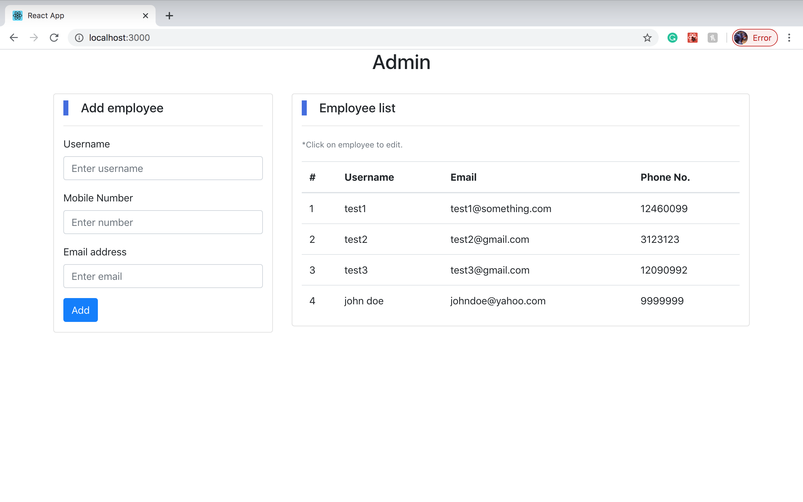

# Employee Admin
Basic MERN application that handles CRUD operations of employees while storing their username, email address, and phone number. Made for a programming test.
<p align="center">
  
</p>
### Getting Started
To run this project on your local machine, follow these steps:
1. Start by cloning the repository.
```
git clone https://github.com/rahuljoshi44/employee-admin.git
```
2. Install the dependencies.
```
npm install
```
3. Run this command in the folder.
```
npm start
```
running the above command will start both the express server and the react front end simultaneously.
